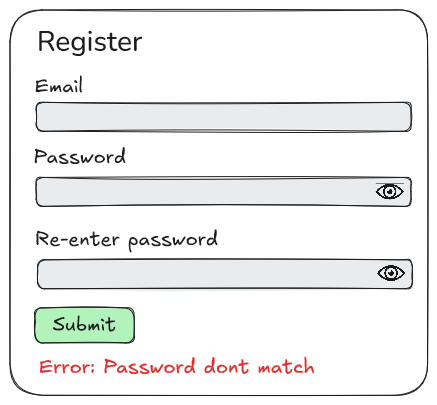

# STORY 01 - REGISTER USER

As a user

I want to be able to register myself

So that I can later login to the app

## Wireframe

# Acceptance Criteria

- A user should be able to create a account
- You should get a error message when passwords dont match
- You should get a error message when the email is already registered
- After registering a new account, the user is redirected to the login page
